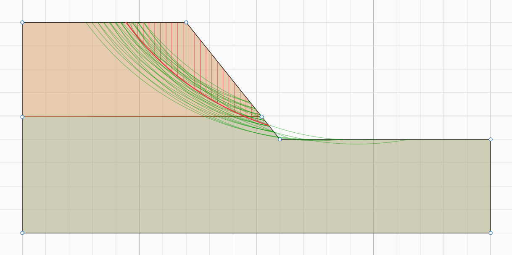
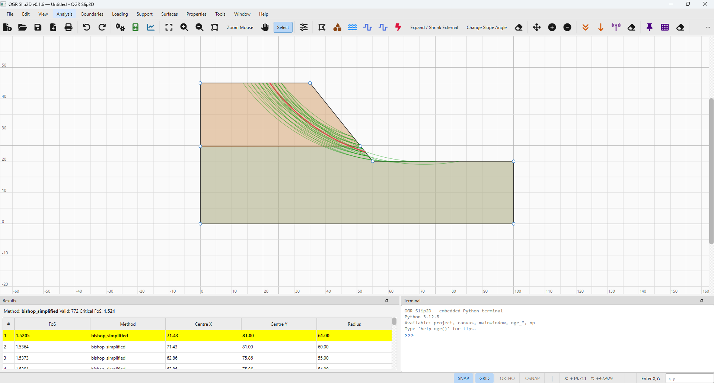
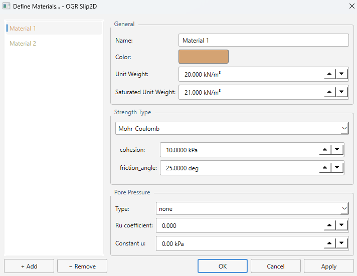
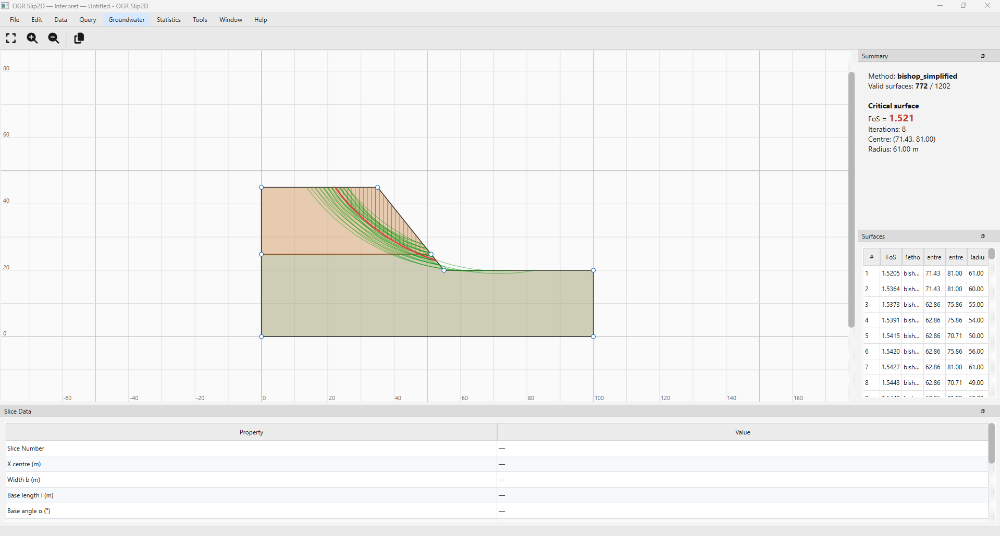

<!-- SPDX-License-Identifier: AGPL-3.0-or-later -->

<div align="center">

# OGR Slip2D

### parte de la suite **OpenGeoRock**

**Software geotécnico de código abierto, construido a la vista de todos.**

Estabilidad de taludes, flujo subterráneo y mecánica de rocas — en Python,
legible, testeado y libre.

[](#tests)
[](LICENSE)
[](#instalación)
[](#hoja-de-ruta)

**Español** · [English](README.md)

[opengeorock.org](https://opengeorock.org) ·
[Contribuir](CONTRIBUTING.md) ·
[Reglas para agentes de IA](AGENTS.md) ·
[Empezar en VSCode](docs/EMPEZAR_EN_VSCODE.md) ·
[Organizar el espacio de trabajo](docs/ORGANIZAR_ESPACIO_TRABAJO.md) ·
[Licencia](#licencia)



</div>

---

## Por qué existe

Casi todo el software del que depende un ingeniero geotécnico es cerrado,
caro y opaco — una caja negra en el centro de decisiones sobre presas,
taludes, túneles y cimentaciones. Cuando un factor de seguridad sale 1.32,
no se puede leer por qué.

OpenGeoRock reconstruye esas herramientas en abierto: un núcleo de cálculo
en Python puro, una interfaz de escritorio moderna, y una suite de tests
que cualquiera puede inspeccionar. **Cada método se publica con el caso de
referencia contra el que se validó**, para que los resultados se puedan
comprobar en lugar de creer.

---

## OGR Slip2D — lo que hace hoy



### Equilibrio límite

Siete métodos, cada uno validado contra un caso de referencia:

| Método | Equilibrio | Error de validación |
|---|---|---|
| Ordinario / Fellenius | momentos | +0.06 % |
| Bishop simplificado | momentos | +0.02 % |
| Janbu simplificado | fuerzas | +0.13 % |
| Janbu corregido | fuerzas | +0.10 % |
| Spencer | fuerzas + momentos | +0.64 % |
| GLE / Morgenstern-Price | fuerzas + momentos | +0.53 % |
| Lowe-Karafiath | fuerzas | +0.09 % |

Seis algoritmos de búsqueda —malla, talud, refinamiento automático,
bloques, trayectorias y recocido simulado— sobre superficies **circulares
y no circulares**, con superficies compuestas, límites de talud y
optimización por paseo aleatorio.

**Búsqueda enfocada** mediante ventana, línea, punto o **tangente**, que
filtra los círculos *antes* de evaluarlos: en el caso de referencia, una
tangente a una capa débil deja 17 evaluaciones de 206.

Dieciocho modelos de resistencia (Mohr-Coulomb, no drenado, Hoek-Brown y
Hoek-Brown generalizado, curva potencial, hiperbólico, Barton-Bandis,
anisótropo lineal, funciones corte-normal y anisótropa generalizada,
SHANSEP, relación de tensión vertical…), siete tipos de soporte, cargas
distribuidas y lineales, sismo pseudoestático y grietas de tracción.



### Agua subterránea por elementos finitos

Un motor de filtración completo, no una tabla de consulta:

- **Mallado T3** sobre las regiones de material, conforme entre interfaces
  por construcción.
- **Régimen permanente saturado** con tensor de conductividad anisótropo
  por material.
- **Flujo no saturado** con seis funciones de permeabilidad —simple,
  Brooks-Corey, Fredlund-Xing, Gardner, van Genuchten y definida por el
  usuario— resuelto por iteración de Picard con relajación.
- **Superficie libre y caras de rezume** por conmutación nodal.
- **Análisis transitorio** por etapas, con la forma mixta de la ecuación de
  Richards, iteración de Picard modificada y **factor de seguridad por
  etapa**: un desembalse se convierte en una historia de estabilidad.
- **Acoplamiento con la estabilidad**: presiones interpoladas en las bases
  de dovela, con succión mediante la envolvente extendida de Mohr-Coulomb.

### Probabilístico y sensibilidad

Siete distribuciones con truncamiento por mínimo y máximo **relativos**,
Monte Carlo e **hipercubo latino**, correlación cohesión–rozamiento,
análisis de Mínimo Global y de Talud Completo, probabilidad de fallo,
índice de fiabilidad, superficie probabilística crítica, gráficos de
convergencia y barridos de sensibilidad ordenados por influencia.

### Interpretación de resultados



### Y además

Coeficientes parciales del **Eurocódigo 7** (DA1-C1, DA1-C2, DA2, DA3),
retroanálisis de la fuerza de soporte, calculador de parámetros de
Hoek-Brown, import y export **DXF** con saneado de geometría, capa de
anotación, informes PDF, interfaz **español / inglés** y una interfaz de
línea de comandos.

---

## Comportamiento verificado, no solo tests en verde

La suite se valida contra **referencias externas e identidades
analíticas**, nunca contra instantáneas de su propia salida — un snapshot
consagra el bug que pudiera existir.

| Qué | Comprobación | Resultado |
|---|---|---|
| Métodos LEM | factor de seguridad de referencia | todos dentro del 0.7 % |
| Filtración confinada | solución cerrada de Darcy | 0.000 % |
| Medios estratificados | medias armónica y aritmética | 0.000 % |
| Anisotropía | ensayo de parcela con Kxy ≠ 0 | precisión de máquina |
| Transitorio | respuesta escalón erfc | 0.11 % |
| Transitorio a tiempo largo | debe reproducir el permanente | 0.0000 m |
| Malla FE | el área iguala la de la región | exacto en todo refinamiento |
| Retroanálisis | activa = pasiva con FS = 1 | identidad exacta |
| Hoek-Brown | GSI = 100, D = 0 → mb = mi, s = 1, a = 0.5 | exacto |
| Ida y vuelta DXF | área idéntica, vértices sobre los originales | < 1e-6 |

El desembalse rápido reproduce el resultado clásico sin que se le diga: el
factor de seguridad es mínimo justo tras bajar el nivel y se recupera al
disiparse las presiones.

---

## Instalación

Python **3.11 o superior**.

```bash
git clone https://github.com/samuelsl27/OGR-Slip2D.git
cd OGR-Slip2D
python -m venv .venv
source .venv/bin/activate        # Windows: .venv\Scripts\activate
pip install -e .
```

Abrir la aplicación:

```bash
ogr-slip2d          # o:  python -m ogr_gui
```

O usarlo desde Python:

```python
from ogr_core.project import Project
from ogr_slip2d import BishopSimplified, GridSearch

project = Project.load("mi_talud.ogr")
search = GridSearch(method=BishopSimplified(), num_slices=25)
result = search.run(project)
print(f"FS crítico = {result.critical.fos:.4f}")
```

---

## Tests

```bash
QT_QPA_PLATFORM=offscreen python tests/_runner.py
```

`QT_QPA_PLATFORM=offscreen` hace falta porque los tests de interfaz
construyen widgets Qt reales; simplemente nunca llegan a una pantalla.

Para trabajar sobre un área concreta se puede ejecutar solo esa parte:

```bash
python tests/_runner.py transient          # solo esos archivos
python tests/_runner.py -k erfc            # solo tests con ese nombre
python tests/_runner.py --list transient   # enseña la selección, no ejecuta
```

Un patrón que no case con nada sale con código 2 en lugar de anunciar un
éxito vacío, y una ejecución filtrada avisa con `FILTERED RUN`: no vale
como evidencia para publicar una versión.

Unas **43 600 líneas** de implementación y **23 300 de tests**, **1724 de
ellos en verde**, sin fallos conocidos. La suite completa tarda entre 5 y
7½ minutos, y esa horquilla es lo honesto: el mismo código, sin tocar nada,
ha dado 5:55, 6:19, 6:41 y 7:22 en la misma máquina.

---

## Estructura

| Paquete | Contenido |
|---|---|
| `ogr_core/` | Geometría, materiales, cargas, soportes, proyecto, hidráulica, estadística, anotaciones, DXF |
| `ogr_slip2d/` | Motor de equilibrio límite: métodos, búsquedas, rebanado, foco, optimización, retroanálisis |
| `ogr_fem2d/` | Elementos finitos: mallado y solvers de filtración |
| `ogr_gui/` | Interfaz PySide6: lienzo, diálogos, ventanas de interpretación, traducciones |
| `ogr_cli/` | Interfaz de línea de comandos |
| `ogr_data/` | Reserva para la base de datos de materiales (prevista para v0.2.0) |
| `validacion/` | Casos de validación: modelo, valores esperados y su fuente |
| `spec/` | Especificaciones (constitución del proyecto y features) |
| `docs/` | Planes, auditorías y changelog |
| `tests/` | Un archivo por área funcional |

---

## Hoja de ruta

OGR Slip2D es el primero de cinco programas.

| # | Programa | Alcance | Estado |
|---|---|---|---|
| 01 | **OGR Slip2D** | Estabilidad 2D, FEM de filtración, probabilístico | **en desarrollo** |
| 02 | OGR Data | Base de datos de propiedades, correlaciones y ábacos | planificado |
| 03 | OGR FEM2D | Elementos finitos elastoplásticos 2D | planificado |
| 04 | OGR Slip3D | Superficies de equilibrio límite en 3D | planificado |
| 05 | OGR FEM3D | Elementos finitos 3D con flujo acoplado | planificado |

Lo siguiente en Slip2D: instaladores, más casos de validación y la base de
datos de materiales.

---

## Contribuir

Se agradece cualquier ayuda: código, validación con casos reales, informes
de fallo, o simplemente probar el programa en un proyecto de verdad y
contar qué se rompió.

Lee primero [`CONTRIBUTING.md`](CONTRIBUTING.md): explica las siete
condiciones que debe cumplir un cambio y **por qué existe cada una** —
todas se remontan a un problema real de este proyecto. La primera es la
más importante: el trabajo numérico se valida contra algo externo, nunca
contra una captura de la salida actual.

**Lo más valioso que puedes aportar son casos de validación.** Si tienes un
talud cuyo factor de seguridad conoces por una publicación, otro programa o
un cálculo a mano, abre una incidencia con la plantilla *Validation case*.
Así es como se construye la confianza en un motor de cálculo.

### Si desarrollas con agentes de IA

El repositorio incluye [`AGENTS.md`](AGENTS.md) con el contrato completo:
stack, comandos, las siete reglas, el flujo de trabajo y una lista
explícita de qué no hacer. Hay además comandos y *skills* en `.claude/`, y
plantillas de especificación en `spec/`.

Se acepta código escrito con ayuda de IA **con la misma vara de medir que
el resto**: si no sabes explicar por qué una línea está ahí, no la envíes.
La responsabilidad de lo que se fusiona es de quien lo firma.

Las contribuciones se aceptan bajo los términos de [`CLA.md`](CLA.md).

---

## Licencia

**GNU Affero General Public License v3.0 o posterior**
(AGPL-3.0-or-later). El texto íntegro está en [`LICENSE`](LICENSE).

En la práctica:

- Puedes usar OGR Suite libremente, **incluso para trabajo profesional de
  ingeniería**, y facturar ese trabajo sin pagar nada ni publicar nada.
  Ejecutar un programa no es una actividad restringida.
- Si lo **modificas** y dejas que otros usen tu versión **en remoto a
  través de una red** (un servicio web o SaaS), debes ofrecerles el código
  de tu versión. Cobrar por ese servicio está permitido; mantenerlo cerrado
  no.
- **No hay garantía de ningún tipo.** Los resultados deben contrastarse con
  cálculos independientes antes de basarse en ellos. Quien firma un
  proyecto es una persona, no un programa.

Cada archivo lleva su identificador SPDX, y un test falla si a alguno le
falta.

> **Nota sobre el cambio de licencia.** Hasta v0.1.42 el proyecto fue
> GPL-3.0. Pasó a AGPL en v0.1.43 para que una versión modificada ofrecida
> como servicio de red tenga que publicar su fuente, cosa que la GPL no
> exige porque servir un programa no es distribuirlo. Los changelogs
> anteriores siguen diciendo GPL-3.0 a propósito: registran lo que era
> cierto entonces.

---

## Equipo

**Samuel Sáez López** — autor, titular del copyright y mantenedor.
Ingeniero de minas y doctorando en la **Universidad Politécnica de
Cartagena (UPCT)**, en el programa *Tecnología y Modelización en Ingeniería
Civil, Minera y Ambiental*. Su investigación doctoral sobre estabilidad de
taludes y mecánica de rocas alimenta directamente los métodos numéricos que
aquí se publican.

**Prof. Emilio Trigueros Tornero** — director académico de la
investigación doctoral en la UPCT y colaborador en la dirección científica
del proyecto, aportando criterio en mecánica de rocas y metodología de
investigación.

Colaboradores: **Universidad Politécnica de Cartagena** (marco académico) e
**IMGA S.L.P.** — Ingeniería Minera, Geológica y Ambiental (colaborador
profesional).

### Autoría

Para que el reparto de contribuciones no deje lugar a dudas: Samuel Sáez
López es el **autor y titular del copyright** del código fuente; Emilio
Trigueros Tornero aporta **dirección académica y colaboración
científica**.

---

## Citar

Si OGR Suite contribuye a un trabajo publicado:

```bibtex
@software{ogr_suite,
  author  = {Sáez López, Samuel},
  title   = {{OGR Suite (OpenGeoRock)}: análisis geotécnico de código
             abierto de estabilidad de taludes y flujo subterráneo},
  year    = {2026},
  url     = {https://opengeorock.org},
  note    = {Universidad Politécnica de Cartagena. AGPL-3.0-or-later}
}
```

---

<div align="center">

**[opengeorock.org](https://opengeorock.org)**

© 2026 Samuel Sáez López — Universidad Politécnica de Cartagena ·
AGPL-3.0-or-later

</div>
